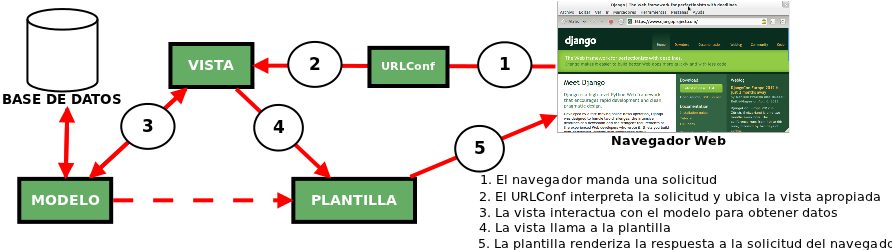

# Django Framework #

## Framework para perfeccionistas con límites de tiempo ##

Fredy Abel Huanca Torres 
Universidad Peruana Unión 
@bellbian • abel.huanca@upeu.pe 
http://abelthf.upeu.pe/ 
 
04 de Junio de 2013

---

# ¿Quien soy? #

## Ing. de Sistemas ##
## Durante el día: Profesor de redes, sistemas operativos, algoritmos y Estructura de datos en java :(##
## Por la noche: un prometedor ninja python :) ##

---

# Temario #

## 1. Introducción al lenguaje Python ##
## 2. Introducción al Framework Django ##
---

# 1. Introducción a Python #
## - Interpretado ##
## - Facil de aprender ##
## - Identado ##
## - Multiparadigma ##
## - No marcadores de bloque, tienes que identar ##
## - Código legible antes que rápido ##

---

# Python es mas productivo (que java) #
## - Tipado dinámico ##
## - Shell interactiva ##
## - Código más limpio: menos “verboso” y escribes menos ##

---

# Python vs Java #
## Java ##

## public class HolaMundo ##
## { ##
##   public static void main (String[ ] args) ##
##   { ##
##      System.out.println("Hola mundo"); ##
##   } ##
## } ##

# Python #
!python
print “Hola mundo”

---

# Introducción Django #
## - ¿Que es Django? ##
## - Características ##
## - Mi primer proyecto Django ##

---

# QUE ES DJANGO #
## * Django es un framework web en Python de alto nivel que permite un desarrollo rápido y un diseño limpio y pragmático. ##
## * Su objetivo principal es facilitar la creación de webs complejas apoyadas en bases de datos. ##
## * Inicialmente desarrollado en un entorno de noticias en línea (“The World Company”) ##
## * Diseñada para que el desarrollador se concentre en la lógica de negocio y olvide detalles rutinarios ##
## * Django automatiza todo lo posible adhiriéndose al principio DRY (Don’t Repeat Yourself) ##

---

# ¿Y EL NOMBRE? #
## Jean “Django” Reinhardt (famoso guitarrista de Jazz belga romaní) ##
## http://www.youtube.com/watch?v=AEzsPGHsi90 ##

---

# Caracterísiticas Django #

## - Echo en python ##
## - Desarrollo muy rápido ##
## - Busca el perfeccionismo ##
## - Patron MTV ##
## - Incluye una interfaz administrativa CRUD  generada dinámicamente a partir del modelo de datos ##
## - Incluye un servidor de desarrollo ##
## - Soportado por Google App Engine ##

---
# Diseño Perefecionista #
## - Código muy legible ##
## - Exquisita metodología de desarrollo ##
## - Perfecta documentación ##

---

# COMPONENTES FUNDAMENTALES #
## * Mapeador objeto-relacional (ORM) (Model) ##
## * Gestor de peticiones web (VIEW:URLs) ##
## * Sistema de Vistas (/VIEW) ##
## * Sistema de Plantillas (Template) ##

---

# ¿COMO TRABAJA? #

## 1. La aplicación recibe una petición por medio de URLconf, ##
## 2. URLconf envia a la vista dicha petición. ##
## 3. La vista tiene dos posibilidades, ##
## - enviar a la Plantilla entregue algo al cliente ##
## - solicitar información del Modelo, renderizar con la plantilla y finalmente se le entrega al cliente. ##
## 4. el modelo interactua con la base de datos por medio de ORM ##

---
# OTROS COMPONENTES #

## Servidor web ligero para desarrollo y pruebas de aplicaciones ##
## Interfaz de administración automática ##
## Sistema de fomularios ##
## Sistema de autenticación / autorizacion ##
## Internacionalización ##
## Sistema caché ##
## Framework de sindicación ##
## Framework testing unitario y funcional ##
## ... ##

---

# Recursos básicos #
## Documentación Oficial: http://docs.djangoproject.com/ ##
## Wiki, SVN, Tickets, etc. ##
## http://code.djangoprojects.com/ ##
  
---
# DISEÑO DE URLs #
## * No se requieren URLs horribles ##
## foo.es/bar/s_view/infrastructure/0,2545,TCP167364285088,00.html
## foo.es/noticias.php?anyo=2006 ##
## Independencia entre URLs y lógica de aplicación ##
  
# Se quiere arquitectura REST #
## foo.es/noticias/2008/ ##
## foo.es/noticias/crear/ ##
## foo.es/noticias/conf-oswc/borrar/ ##

---
# VISTAS #

## * Realizan la lógica de la aplicación ##
## * Suele renderizar una plantilla ##
## Ejemplo: ##
## from news.models import Noticia ##
## def lista_anual(request, anio): ##
## noticias = Noticia.objects.filter(anyo=anyo) ##
## return render_to_response('noticias.html',  {'noticias': noticias}) ##

---
# PLANTILLAS ##
## - No incluir lógica en las plantillas ##
## - No usar XML ##
## - Facilita la sintaxis para el diseñador ##
## - Lenguaje propio ##
## - muy legible ##
## - Soporta herencia de plantillas ##
## -- Extensible ##
---
# PLANTILLAS: #
## ejemplo: ##

##  ##
##  ##
## <ul> ##
##   ##
##   <li> ##
##    <a href="/noticias/{{ n.id }}/"> ##
##      {{ n.titulo|upper }} ##
##    </a> ##
##   </li> ##
##    ##
## </ul> ##
##  ##

---

# Demo #

---
# No olvidar, fácil !=  sensillo #
## Ha estudiar Django + Python #
--
# Gracias por la atención #
---

